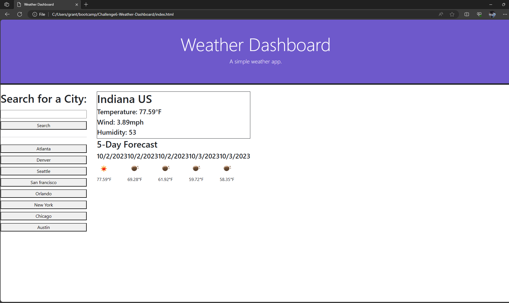

# Challenge6-Weather-Dashboard
<h1>Description</h1>

This javascript application was created to provide the user with a Weather Dashboard.

<h1>Usage</h1>
Steps to use my Weather Dashboard:
<li>Step 1. Either type a city into the text field and click search or click on one of the city buttons</li>
<li>Step 2. Click the save button and your input will be saved to local storage.</li>

<h1>Application</h1>
https://neongreen64.github.io/Challenge5/

<h1>License</h1>

Please refer to the LICENSE in the repo.

